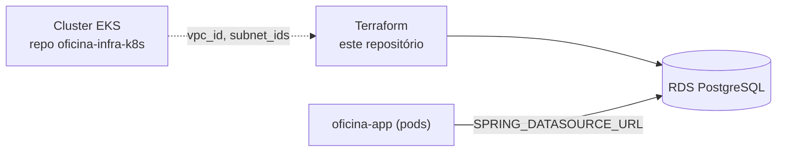

# oficina-infra-db

Infraestrutura do banco de dados gerenciado (Terraform) do projeto Oficina:
provisiona um RDS PostgreSQL na VPC do cluster EKS. Um dos quatro
repositórios do projeto — isolado do restante da infraestrutura por ser um
domínio de mudança mais sensível (dados) e com blast radius diferente do
cluster/aplicação.

## Propósito

Implementa o requisito de infraestrutura obrigatória "Banco de Dados
Gerenciado (PostgreSQL, MySQL, SQL Server, etc.)". Ver a justificativa formal
completa da escolha de PostgreSQL/RDS no repositório `oficina-app`
(`documentacao/rfcs/0002-escolha-do-banco-gerenciado.md`).

## Tecnologias

- Terraform (`hashicorp/aws`)
- AWS RDS PostgreSQL

## O que provisiona

- `infra/terraform/modules/postgres-db` — instância RDS PostgreSQL, subnet
  group e security group (ingress na porta 5432 restrito a
  `allowed_cidr_blocks`).
- `infra/terraform/environments/dev` — ambiente que instancia o módulo acima,
  recebendo `vpc_id`/`subnet_ids` do repositório `oficina-infra-k8s` (o RDS
  precisa estar na mesma VPC do cluster que vai consumi-lo).

## Deploy

```bash
cd infra/terraform/environments/dev
cp terraform.tfvars.example terraform.tfvars   # preencher os valores
terraform init
terraform apply -var-file=terraform.tfvars
```

`vpc_id`/`subnet_ids` vêm do repositório `oficina-infra-k8s`
(`terraform output -raw vpc_id` / `terraform output -json subnet_ids`
naquele repo). Os outputs deste repositório (`db_endpoint`, `db_port`,
`db_name`, `db_username`) são consumidos pelo repositório `oficina-app` para
configurar `SPRING_DATASOURCE_URL` no ambiente de destino (ver
`documentacao/infraestrutura.md` naquele repo, seção "Integração Terraform ->
Kubernetes").

CI/CD (GitHub Actions):
- `.github/workflows/plan-infra.yml` — `terraform fmt/validate/plan` +
  scanners de segurança (`tfsec`, `checkov`) em todo PR.
- `.github/workflows/deploy-infra.yml` — disparado manualmente; `apply`
  automático apenas com `terraform_auto_apply=true` (ambiente `production`).

Segredos esperados no GitHub: `AWS_REGION`, `AWS_ROLE_TO_ASSUME`,
`DB_PASSWORD`, `EKS_VPC_ID`, `EKS_SUBNET_IDS` (JSON, ex.:
`["subnet-xxx","subnet-yyy"]`).

## Arquitetura



## Branch protection

`main` protegida contra push direto; merge somente via Pull Request
(gatilho de `plan-infra.yml`); deploy disparado manualmente após merge, com
`apply` exigindo confirmação explícita e aprovação do ambiente `production`.

## Observação de escopo

Terraform deste repositório **não foi validado** com `terraform validate`
real (CLI indisponível no ambiente onde este repositório foi extraído do
monorepo `oficina`) — revisar antes do primeiro `apply`.
